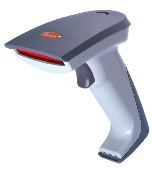
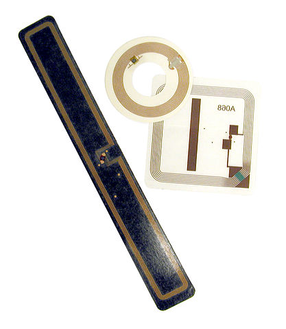

# 4.7.4 External hardware devices

## Lesson Notes
Peripherals are hardware that can be plugged into a computer, for input and output of information. Examples of these include keyboards, mice and monitors. If a input/output device is embedded into the system (e.g. trackpad, touchscreen) it is **not** an external hardware device.

These peripherals connect to the processor through the motherboard, using various protocols and connectors, e.g. USB, VGA, HDMI, PS/2 etc.

### Embedded Systems
An embedded system is a computer that is part of a larger system, which is limited to a certain range of tasks. They are typically smaller, use less energy, and cannot be reprogrammed easily. This allows automation within systems, for example:

- Televisions
- Washing machines
- Blu-ray players
- Digital cameras
- Mobile phones
- Lifts
- Cars

Embedded systems contain almost all the required components within a single PCB, and often many functions are contained within a single integrated circuit.

## Specification

### 4.7.4.1 Input and output devices

#### Input Devices
Input devices allow input into a computer.
Some examples include:

- Mice
- Keyboards
- Trackpads
- Microphones
- Webcams

##### Biometric Authentication
Biometric Authentication significantly increases security,  by requiring a physical characteristic from the user to be measured in order to check whether the user is who they say they are. This is much better than passwords as biometrics have more entropy than most passwords, and do not need to be remembered.

##### Camera
A relatively late invention. Arrived even after the singing plastic fish. They use CMOS sensors to capture images.

Cameras are used within manufacturing for many purposes. This includes CCTV, for ensuring that the security of the factory is not breached, and tracking employees.

Cameras are also used for checking whether parts have been manufactured correctly, allowing an automated system to compare the reference photo with the current part being produced. This means that companies can produce higher quality parts by discarding ones that do not fit tolerable levels of error.

Alternatives to digital cameras include motion sensors and IR photodetectors, however these are often inaccurate and do not provide much information. For example, motion sensors will only tell you the presence of a criminal instead of an identifiable image.

##### Complementary Metal Oxide Semiconductor
Made of light-sensitive cells, that capture light. The cells are closed after enough light has entered, and how long they are open for is called the exposure time, which can be changed to suit the conditions of the environment. The light creates an electrical signal in each cell, which is measured to calculate the light in each cell, in order to capture the image. 

Light must be split into three primary colours, usually using a Bayer filter, which is a grid of coloured filters over the cells, that filter what light gets to which pixels. They are arranged in a special pattern to be reconstructed using a demosaicing algorithm, to find the true colour of the pixel.

One technique to reduce noise in images is to include "microlenses" between the cells, to increase the amount of light that gets to them, reflecting the light into the cells.

<!--#### Digital Single Lens Reflex
TODO// -->

##### RAW file format
The RAW file format contains untouched "raw" pixel information, with just one colour per pixel. This is then "developed" into a full JPEG or TIFF image file, which is then stored in the memory card. This developing process can be done on a computer instead of the camera, allowing for more customisation over the final output. 

##### Barcode Readers

> A barcode scanner. Photo from https://commons.wikimedia.org/wiki/File:Barcode-scanner.jpg

Barcode readers use a laser to read product details from a 1-dimensional code, printed on the product. The laser is pointed at the barcode, and the intensity of light reflected back to the reader is read by a sensor. This is then translated into a code, which can be used to identify the product.

The most common use of this is in shops, where the UPC format is used to identify products.

One way to use a barcode reader in industry is to manage industry and construction parts of a product. This means the company will know how much stock it has. It also allow the company to make sure they have the correct piece of equipment required in the manufacturing process.

It could also allow you to keep track of their equipment a lot easier as you will have to scan out and in what you use so that things don't go missing. This will also prevent theft as they will know if it was scanned out and if it was scanned back in again. If you integrated digital cameras then you will know a time window as for when it was last checked out.

This will furthermore allow you to keep track of process as you go through the manufacturing process as you know if it wants to be custom or not.

##### RFID scanners

> An assortment of RFID tags. Photo from https://commons.wikimedia.org/wiki/File:RFID_Tags.jpg

RFID scanners can scan electronic tags at close proximity. They emit an electromagnetic signal, which powers the tags. The tags then respond with the data contained in them.

RFID allows manufacturers to store information about a part while it is being manufactured. This can include the part colour, size, and calibration data, so that actions can be done based on this data.

RFID also allows manufacturers and resellers to keep track of inventory  and order (or manufacture) new parts when stock is low. This means that less money is wasted on parts that are not used.

Alternatives to RFID include barcodes and QR codes. These are often not as suitable as RFID, as they must be in close proximity to read, and they store very limited amounts of data. They also require line-of-sight, so RFID can be used for parts in boxes, already packaged.

#### Output Devices
##### Laser printers
Laser printers negatively charge a drum. A laser is then used to neutralise this charge in some places, to form a negative image. The drum is then coated in toner, which is repelled by the negative charge. The drum then rolls over the paper, depositing the toner. The toner is then sealed to the paper using heated rollers.

Laser printers can be used to print labels for shipping as they print reliability and quickly, this is very useful for a manufacturer as you need something to work around the clock as a lot are produced.

Printing barcodes, you could use a inkjet but it takes a lot longer to print and could come out with imperfections but as a laser printer is so exact it will be up to standard and more readable which is necessary for barcodes or qr codes.

Printing designs for new products is a necessity for most manufacturing company as designs for new product can need to be shown to higher management in presentations, this means that it will need to be high quality print out with high degree of accuracy.
<!-- 
// TODO have we covered this? -->

### 4.7.4.2 Secondary storage devices
Secondary storage is used to store permanent data that the user needs to keep. This is needed as main memory is volatile, and most uses of computer systems require data storage. They reduce physical space requirements, as they can store data much more efficiently and quickly than paper, and are less prone to human error.

#### Backing Storage
##### Magnetic
|Name|Description|Standard Capacity|
|---|---|---|
|Hard Drive|The common hard drive uses a magnetic head to read data from discs within it.|1 terabyte|
|Magnetic tape|Used for slow, cheap archival of large amounts of data.|10 terabytes|
|Floppy disk|Used for transfer of programs and data between multiple systems. Not commonly used anymore.|1.44 MB|

##### Optical
|Name|Description|Standard Capacity|
|---|---|---|
|CD|Primarily used for storing music.|700 MB|
|DVD|Primarily used for storing standard-definition video.|4.7 GB|
|Blu-ray|Primarily used for storing high-definition video.|25 GB|

##### Solid state
Solid state drives have no moving parts, and use transistors to store data. This means that they are significantly faster than hard drives. However, they have slightly lower capacities than hard drives, and are more expensive. They also have a limit to the number of times a block can be written to, although this is high enough for most uses.

##### Cloud Storage
> A lot of data is now stored in *"the cloud"*.

This mythical storage system uses computers far away that stores your data. This is a very new way of storing data, that uses the internet for data access. This means that you are trusting another company with your data, however it does provide redundancy so that if your datacentre burns down, your data will not be lost.

However, the legislation in other countries may be different, so that your data may be used by the company you are storing it with for other uses.
